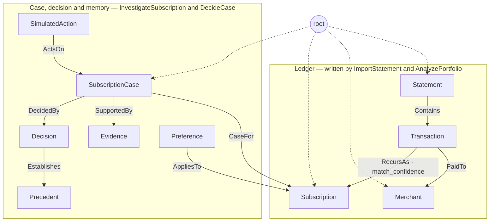
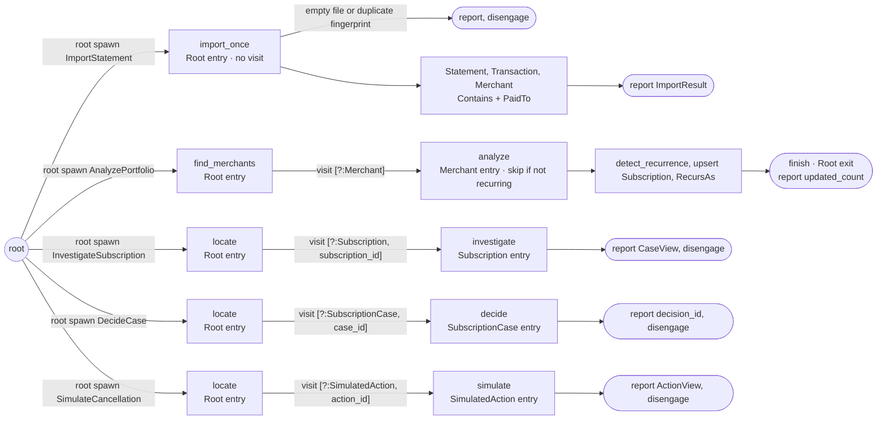
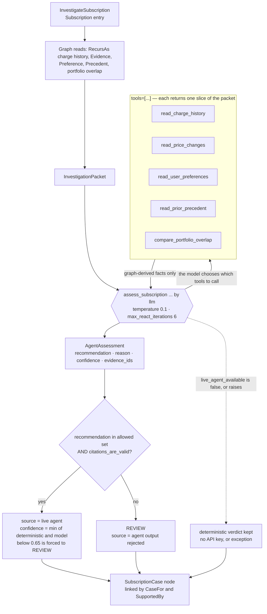
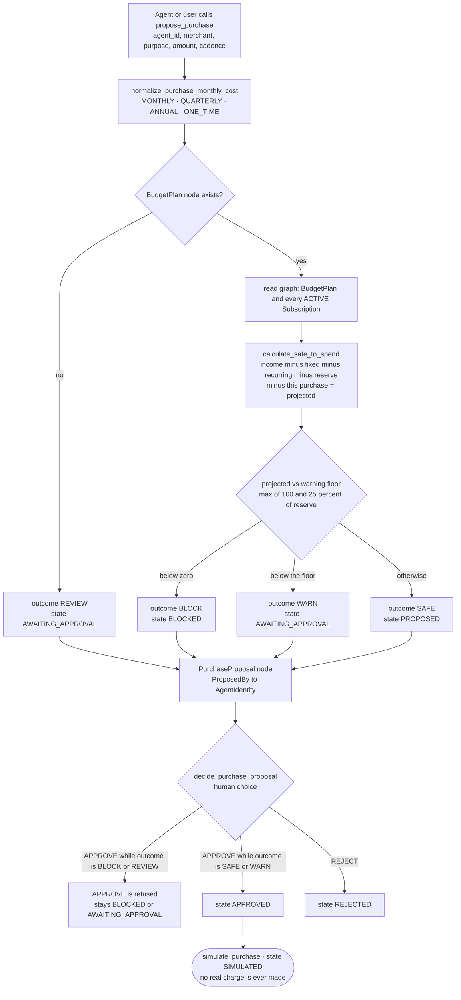
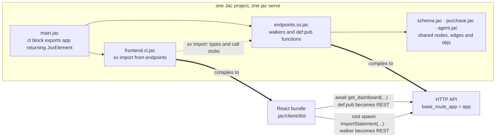

<div align="center">

# SpendOS

**A quiet financial agent that finds waste, protects what matters, and never spends without you.**

[](https://www.jac-lang.org/)
[](https://docs.jaseci.org/)
[](https://docs.jaseci.org/reference/)
[](https://docs.jaseci.org/)
[](spendos/tests)
[](https://jachacks-sf.devpost.com/)

*Built at **JacHacks San Francisco 2026** — one day, in Jac.*

</div>

---

## What it does

Start with a bank statement. SpendOS finds the recurring charges, **investigates the
important ones with an agent that reasons only from graph evidence**, remembers what
you decided last time, and turns it all into an action inbox you can trust.

Then it does the harder half: when an AI agent wants to *spend* money, SpendOS
answers **"can we afford this?"** with arithmetic — not with a model.

Two loops, deliberately different:

| Loop | Who decides | Why |
|---|---|---|
| **Subscription investigation** | An LLM agent with 5 graph-reading tools | "Is this worth keeping?" is a judgment, not a threshold |
| **Purchase guard** | Pure arithmetic over the graph | Money must never move on a model's opinion |

---

## Why this is a Jac project, not a Python project with `.jac` files

Six load-bearing constructs. We deliberately don't claim twelve — these are the
ones that survive being probed, and every one has a line number.

| # | Construct | Where | What it does *here* |
|---|---|---|---|
| 1 | **Walkers** (`walker:pub`) | `endpoints.sv.jac:793, 886, 970, 1124, 1218` | 5 walkers traverse the ledger; computation moves to the data |
| 2 | **Filtered traversal** | `endpoints.sv.jac:975, 1130, 1222` | `visit [here-->[?:Subscription, subscription_id==self.subscription_id]]` — type **and field** filter in the itinerary, so an unknown id yields zero visits instead of raising. (`:890` is a type-only fan-out.) |
| 3 | **`disengage`** | `endpoints.sv.jac:802, 814, 986` | A walker stops the instant its work is done; the node it stopped on is the record |
| 4 | **`by llm(tools=[...])`** | `agent.jac:72` | A real ReAct loop — the **model** chooses which of 5 evidence tools to call, up to 6 turns |
| 5 | **Typed nodes + edges** | `schema.jac`, `purchase.jac` | 20 nodes and 14 declared edge types, of which **6 are load-bearing** (created *and* traversed): `Contains`, `PaidTo`, `RecursAs`, `CaseFor`, `ActsOn`, `Holds`. `RecursAs` carries `match_confidence` **on the edge** and is traversed in both directions. The rest are written but not yet read back. |
| 6 | **One project, two artifacts** | `main.jac`, `frontend.cl.jac`, `endpoints.sv.jac` | `.cl.jac` compiles to React, `.sv.jac` stays server-side, shared `schema.jac` **is** the wire contract |

The sixth is the one that's hard to appreciate from outside: **the frontend is written
in Jac.** The client calls the server by writing ordinary Jac — `await get_dashboard(...)`
for a `def:pub`, `root spawn ImportStatement(...)` for a walker. No hand-written fetch
layer, no OpenAPI codegen, no duplicated types across a language boundary.

---

## The graph

Every arrow below is a typed edge declared in `schema.jac`.



`RecursAs` is the only edge carrying a property. Dotted lines are the generic
`root ++>` anchors, abbreviated for legibility.

---

## Walkers: computation that moves



Five walkers, one entry point. `ImportStatement` never leaves `root`.
`AnalyzePortfolio` fans out to every `Merchant` and reports on **`Root exit`**.
The last three locate exactly one node and `disengage`.

---

## The agentic loop



**Nothing the model returns is trusted.** An unrecognised recommendation, or a
citation pointing outside the packet's `evidence_ids`, is rejected back to
`REVIEW`. Confidence is the **minimum** of the deterministic and model scores.
With no API key the deterministic verdict simply stands — the app runs either way.

---

## Money moves on arithmetic, never on a model



**An agent that approves its own `BLOCK` gets `BLOCKED` back.** The terminal state
is `SIMULATED` — there is no payment rail in this code.

---

## One project, two artifacts



---

## Quickstart

```bash
# Jac ships as one native binary — byLLM is bundled with it.
curl -fsSL https://raw.githubusercontent.com/jaseci-labs/jaseci/main/scripts/install.sh | bash

cd spendos
jac test                   # 28 passing, deterministic, no API key needed
jac start -d               # UI + API. The -d is REQUIRED.
```

> ⚠️ **`jac start -d`, not `jac start`.** Bare `jac start` *does* build the client
> bundle — but it does not mount it at the root: `GET /` and `/app` return **404**
> (only `/cl/app` serves). With `-d`, `/` returns 200. Read the `App:` line in the
> log for the real port; it drifts if one is already held.

> ⚠️ **Do not `pip install byllm`.** It ships inside the `jac` binary; a pip copy
> shadows it and breaks imports.

**Optional — an LLM key** enables the live investigation agent:

```bash
cp .env.example .env      # set ONE of OPENAI_API_KEY / ANTHROPIC_API_KEY / GEMINI_API_KEY
```

Without a key the app still runs end to end; the agent falls back to its
deterministic verdict. That degradation path is the default, not an afterthought.

---

## What's honest about this

We'd rather you read this than find it out.

- **The data is synthetic.** `data/sample_statement.csv` and `synthetic_bank_feed.csv`
  are generated. SpendOS does **not** connect to a bank.
- **Nothing is ever charged.** The terminal purchase state is `SIMULATED`. There is no
  payment rail, no card, no ACH.
- **No subscription is really cancelled.** `SimulateCancellation` simulates.
- **The "live feed" is a deterministic simulation** for exercising the guardian loop —
  not real-time account monitoring.
- **The agent can be wrong, and the code assumes it will be.** Citations are validated
  against the packet; unverifiable output is downgraded to `REVIEW`.
- We have **not** tested it against an attack we didn't anticipate. The claim is the
  architecture, not a detection rate.

---

## Repo layout

```
.
├── README.md              # you are here
├── SIMPLE_PLAN.md         # incremental product contract
├── PRODUCT_PLAN.md        # product and architecture direction
├── Jac docs/              # pinned Jac reference corpus (submodules)
└── spendos/
    ├── schema.jac         # 20 nodes, 14 typed edges, deterministic financial logic
    ├── purchase.jac       # purchase-layer domain model + budget guard
    ├── agent.jac          # by llm(tools=[...]) investigation + evidence tools
    ├── endpoints.sv.jac   # 5 walkers + def:pub endpoints  (server codespace)
    ├── frontend.cl.jac    # the UI, written in Jac         (client codespace)
    ├── main.jac           # entry point — mounts both halves
    ├── data/              # synthetic statements and catalog
    └── tests/             # core, purchase, and purchase-v7 suites
```

---

## Hackathon context

**JacHacks San Francisco** — a one-day, in-person AI hackathon built around
[Jac](https://www.jac-lang.org/), the AI-native language from Jaseci Labs.

- 🗓️ **Sunday, July 26, 2026** · 📍 **Founders, Inc. SF Lab**
- 🔗 [Luma](https://luma.com/9x1573sw?tk=6Ez4kx) · [Devpost](https://jachacks-sf.devpost.com/)
- 💰 **$9,000+ in prizes** · Track: **Agentic AI**

### Team

| GitHub | | |
|---|---|---|
| [@nihalnihalani](https://github.com/nihalnihalani) | [@mayu99](https://github.com/mayu99) | [@yhinai](https://github.com/yhinai) |

### Judging criteria this project targets

| Criterion | Where we made our case |
|---|---|
| **Use of Jac & Jaseci** | 5 walkers, filtered traversal, `disengage`, 14 typed edges, and a frontend written in Jac |
| **Depth of agentic behavior** | A real ReAct loop whose tools read the graph — plus validation that refuses to trust its output |
| **Technical execution** | Deterministic test suite that runs with no API key |
| **Impact & novelty** | The guard says "no" to an agent holding a budget — with arithmetic, not vibes |

---

## Jac reference

```bash
jac guide                  # compiler-matched language guidance
jac guide --search walker
jac mcp --inspect
```

- Language reference — https://docs.jaseci.org/reference/
- Quick guide — https://docs.jaseci.org/quick-guide/
- Source — https://github.com/jaseci-labs/jac

**Sponsors:** NVIDIA · Google DeepMind · Base44 · Lovable · Koyal AI · NSF

<div align="center">

*Built in one day, in Jac.*

</div>
